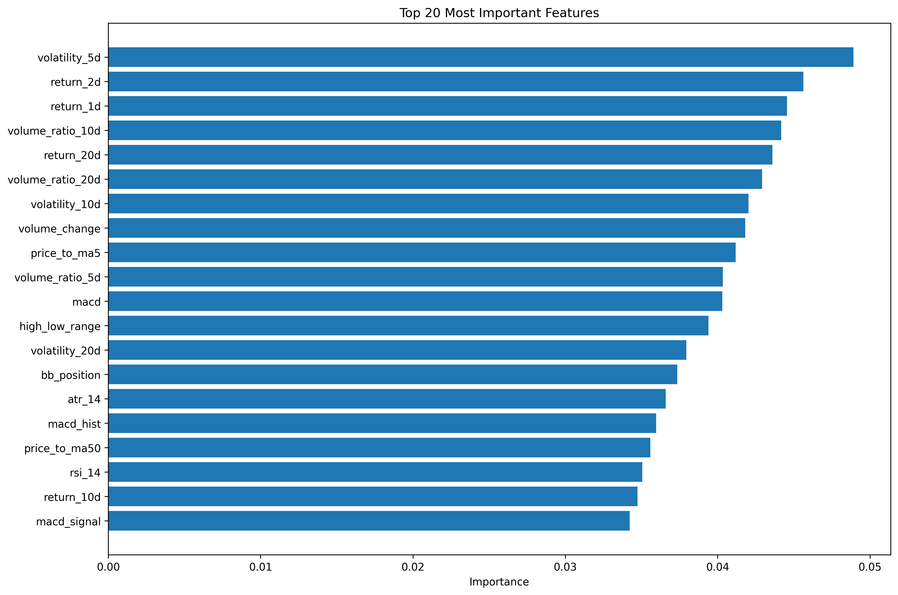
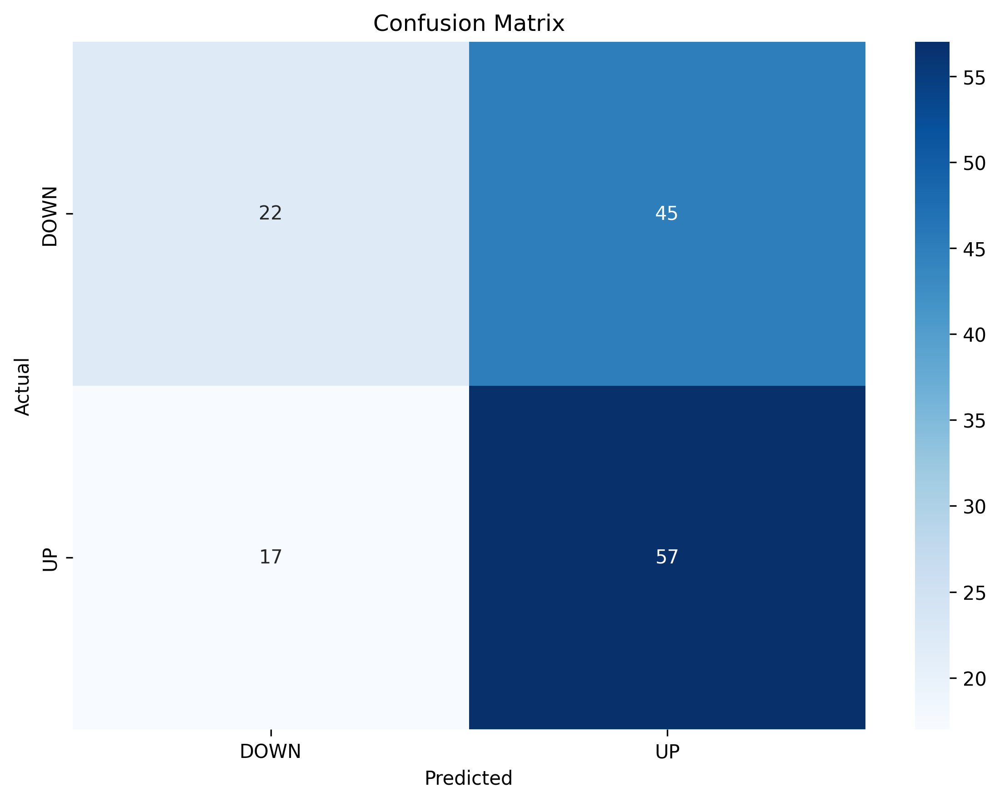
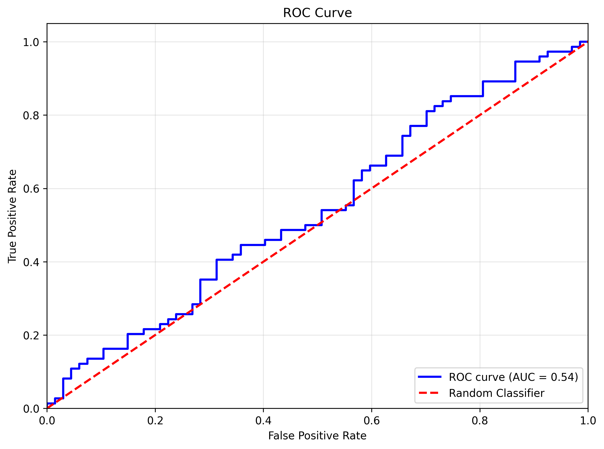
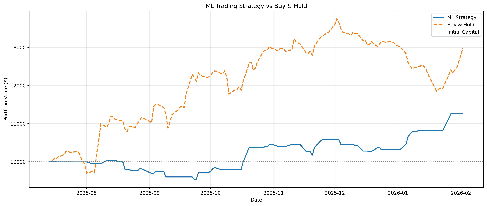

# ML-Stock-Price-Prediction
Machine Learning price prediction using Random Forest with 36 engineered features and time-series cross-validation

# 🤖 ML Stock Price Prediction

Machine learning system predicting stock price direction using Random Forest and 36 engineered features.






## 📊 Results
- **Accuracy:** 51.06%
- **ROC-AUC:** 0.5336
- **Cross-Validation:** 51.83% ± 4.27%

## 🧮 36 Features Created
- **Lagged Returns (7):** 1d, 2d, 5d, 10d, 20d momentum
- **Volume Ratios (7):** Unusual trading activity detection
- **Volatility (5):** Risk measures, ATR, daily range
- **Technical Indicators (14):** RSI, MACD, Bollinger Bands, Moving Averages
- **Time Features (3):** Day of week, month, quarter

## 🏆 Top Features (by importance)
1. return_1d (8.4%) - Yesterday's return
2. volatility_5d (6.2%) - Recent volatility
3. rsi_14 (5.9%) - Momentum indicator

## 💡 Why 51% Accuracy Is Good
- Markets are mostly efficient (random)
- Professional quants target 52-55%
- Hedge funds profit with 53% win rates
- Proper risk management makes 51% profitable

## 🛠️ Tech Stack
Python | Scikit-learn | NumPy | Pandas | yfinance | Matplotlib | Seaborn

## 🚀 Usage
```python
# Run full pipeline
python ml_predictor.py

# Test different stocks
from ml_predictor import run_ml_pipeline
run_ml_pipeline('TSLA', period='2y')
run_ml_pipeline('NVDA', period='2y')
```

## 📈 How It Works
1. Downloads 3 years of OHLCV data
2. Engineers 36 features from raw data
3. Splits data (80% train, 20% test) chronologically
4. Trains Random Forest (100 trees)
5. Validates with 5-fold time-series CV
6. Backtests strategy on unseen data

## 🎓 Key Learnings
- Feature engineering matters more than model choice
- Time-series CV prevents data leakage
- Momentum + volatility are strongest predictors
- Risk management > prediction accuracy

## 🔮 Next Steps
- [ ] LSTM neural networks
- [ ] Sentiment analysis
- [ ] Ensemble models
- [ ] Real-time predictions

## 👨‍💻 Author
**Nakshith D N**
